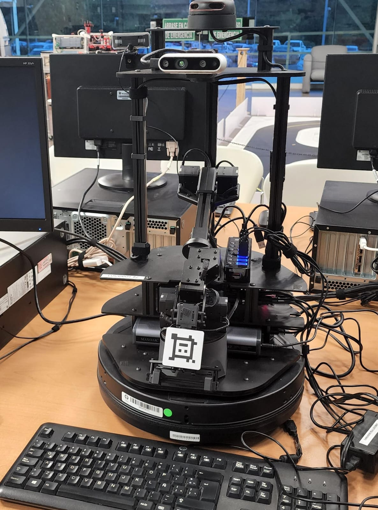
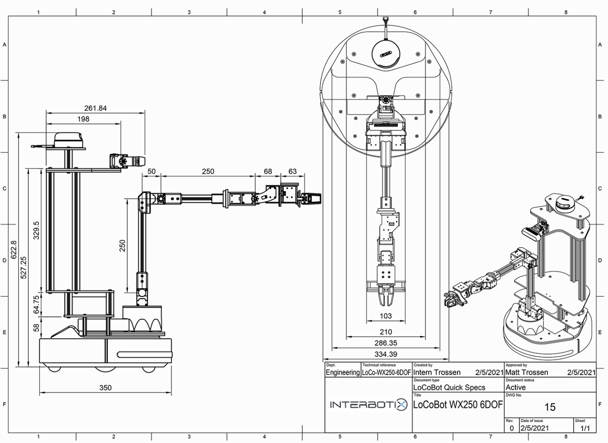

  
  <h1>G-ULV (Greenhouse - Unmanned Land Vehicle)</h1>

## Indice
* [Introduction](#Introduction)
* [Description](#Description)
  1. App
  2. Locobot
     - Navigation
     - RGB Camera
  3. Firebase
  4. Image Processing
  5. ESP32
* [Project Video](#Project-video)
  [Final Prototype](https://www.youtube.com/watch?v=OmEoIHwpt5E)
* [Technology](#Technology)
* [Team](#Team)

## 💻Introduction
Currently, agriculture is one of the most important activities in the human history. Nevertheless, mexican farmers have to face transnational companies. The economical difference between a transnational company and a farmers is bigger. Therefore, this team has developed an idea to support small and medium entrepreneur farmers to improve his work. Owing to the fact that farmers could not get expensive machinery, this project will contribute to incorporate technology with the farmers. 

## 🛠️Description

### App
### Locobot

  

 - Navigation
 - RGB Camera
### Firebase
### Image Processing
### ESP32

## 📹Project Video
[Final Prototype](https://www.youtube.com/watch?v=OmEoIHwpt5E)
## 👨‍💻Technology
- [ROS Noetic](http://wiki.ros.org/noetic)
- Python
  1. OpenCV
  2. PyTorch
  3. firebase-admin
  4. pySerial
  5. rospy
- Firebase
- Ubuntu 22.04
- [LocoBot](https://docs.trossenrobotics.com/interbotix_xslocobots_docs/specifications.html)
- YOLOV5X

## 🥇Team
- Rodrigo Emmanuel Oliveros Vazquez
- Daniel de la Torre Chapell
- Ricardo Garcia Sedano
